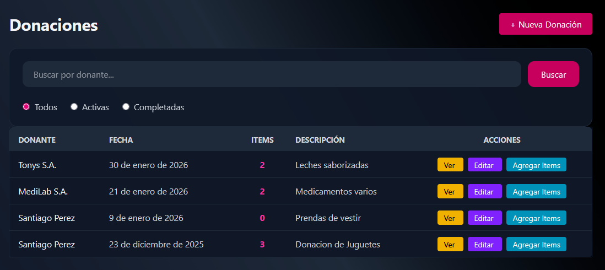
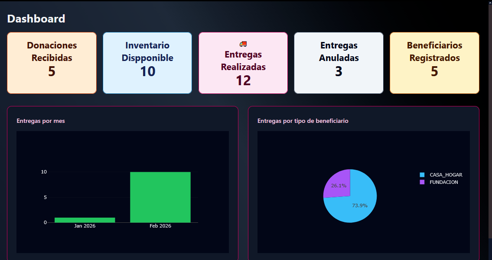
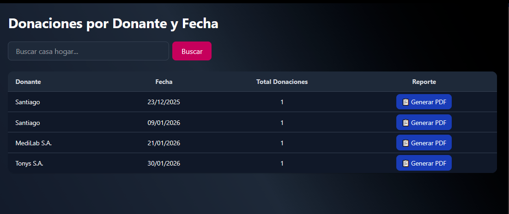

# SEMDA — Sistema de Gestión de Donaciones No Monetarias

Sistema web desarrollado para la gestión de donaciones no monetarias o en especie de una fundación. Permite centralizar la administración de donantes, donaciones, inventario, beneficiarios y entregas, facilitando el control de los artículos recibidos y su distribución.

## Características principales

- **Autenticación y control de acceso:** inicio de sesión, recuperación de contraseña y permisos según el rol del usuario.
- **Gestión de usuarios:** creación, edición, activación y desactivación de cuentas.
- **Gestión de donantes:** registro de personas naturales y jurídicas, consulta y actualización de información.
- **Gestión de donaciones:** registro de donaciones y de los artículos que las componen.
- **Control de inventario:** consulta de existencias disponibles y gestión de artículos.
- **Gestión de beneficiarios:** registro y administración de beneficiarios particulares e institucionales.
- **Gestión de entregas:** seguimiento, confirmación de recepción y anulación de entregas.
- **Dashboard:** visualización de indicadores y gráficos estadísticos.
- **Reportes PDF:** generación y descarga de reportes de donaciones y entregas.

## Tecnologías utilizadas

| Tecnología | Uso |
|---|---|
| Python | Lenguaje de programación del backend |
| Django | Framework web y lógica del servidor |
| Django Templates | Renderizado de las interfaces |
| HTML5 | Estructura de las páginas |
| CSS3 | Estilos de la interfaz |
| JavaScript | Interactividad del frontend |
| Tailwind CSS | Framework de estilos |
| PostgreSQL | Sistema de gestión de base de datos |

## Módulos del sistema

| Módulo | Descripción |
|---|---|
| Dashboard | Indicadores y gráficos sobre donaciones, inventario y entregas. |
| Usuarios | Administración de cuentas y roles. |
| Donantes | Registro y gestión de personas naturales y jurídicas. |
| Donaciones | Registro de donaciones y artículos recibidos. |
| Inventario | Consulta de artículos disponibles y gestión de entregas. |
| Beneficiarios | Administración de beneficiarios particulares e institucionales. |
| Entregas | Consulta, confirmación y anulación de entregas. |
| Reportes | Generación de reportes en formato PDF. |

## Roles y permisos

### Administrador

Dispone de acceso a todas las funcionalidades del sistema, incluyendo:

- Gestión de usuarios.
- Gestión de categorías de productos.
- Generación y descarga de reportes.
- Administración de los módulos del sistema.

### Asistente

Puede gestionar las operaciones habituales de la fundación:

- Donantes y donaciones.
- Artículos e inventario.
- Beneficiarios y entregas.
- Su propio perfil de usuario.

## Dashboard

El dashboard presenta una visión general de la actividad de la fundación mediante los siguientes indicadores:

- Total de donaciones recibidas.
- Total de artículos disponibles en inventario.
- Número de entregas realizadas.
- Número de entregas anuladas.
- Número de beneficiarios.

Incluye gráficos de entregas realizadas por mes y distribución porcentual de las donaciones por categoría de producto.

## Reglas de negocio

- Las donaciones registradas contienen los artículos recibidos por la fundación.
- El inventario permite consultar las existencias disponibles.
- Los artículos se entregan a beneficiarios particulares o institucionales.
- Una entrega se marca como realizada únicamente después de la entrega física.
- Para confirmar una entrega se registra el nombre de la persona que recibe la donación.
- Las entregas anuladas requieren un motivo.
- Una entrega realizada no puede anularse.
- Una entrega anulada no puede marcarse como realizada.
- Los artículos que ya han sido entregados no pueden editarse bajo las condiciones establecidas por el sistema.
- La desactivación de usuarios, donantes y beneficiarios conserva sus registros históricos.

## Reportes

El sistema permite generar y descargar reportes en PDF. Los tipos de reportes disponibles son:

1. Entregas realizadas a casas hogar por fecha.
2. Entregas realizadas a beneficiarios particulares por fecha.
3. Donaciones por donante y fecha.

La generación y descarga de estos reportes está reservada al rol administrador.

## Requisitos de uso

Para acceder al sistema se necesita:

- Un computador, laptop, tablet o teléfono móvil.
- Conexión a internet.
- Un navegador web compatible: Google Chrome, Mozilla Firefox, Safari o Microsoft Edge.
- Una cuenta de usuario activa y sus credenciales de acceso.

## Instalación y configuración

Las instrucciones de instalación y ejecución deben seguir la configuración del proyecto.

Para documentar la puesta en marcha en un entorno local, es necesario especificar:

- La versión de Python y Django requerida.
- La instalación de dependencias.
- La configuración de las variables de entorno.
- La configuración y preparación de PostgreSQL.
- Los comandos para ejecutar las migraciones y levantar el servidor.

## Seguridad

SEMDA cuenta con autenticación de usuarios y control de acceso basado en roles.

Se recomienda:

- No compartir las credenciales de acceso.
- Utilizar contraseñas seguras.
- Cerrar sesión al terminar de utilizar el sistema.
- Cerrar sesión al utilizar equipos ajenos a la fundación.
- Evitar guardar contraseñas en el navegador.

## Alcance y limitaciones

SEMDA fue desarrollado para uso interno de la fundación y está destinado exclusivamente a la gestión de donaciones no monetarias o en especie.

El sistema no contempla conexiones con sistemas externos ni permite el acceso a usuarios ajenos a la fundación.

## Documentación

El proyecto dispone de un Manual de Usuario con instrucciones detalladas para utilizar los módulos, gestionar las donaciones y realizar las operaciones del sistema.

## Autor

**Erik Carcelén**

- GitHub: [@callmeerik](https://github.com/callmeerik)
- Repositorio: [sistema-semda](https://github.com/callmeerik/sistema-semda)
